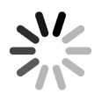
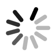

# swiftui-indicator

### Requirements
* iOS 14.0+
* Xcode 12.0+
* Swift 5.3

### Content
* [Documentation](#documentation)
* [RefreshIndicator](#refreshIndicator)
  * [Modifier](#modifier)
    * [Style](#style)
    * [Angle](#angle)
    * [Speed](#speed)


<a name="documentation"></a>
# Documentation

SwiftUI에서 Indicator들을 편하게 쓰기 위해 만들었습니다.  
SwiftUI에서 Indicator를 이용해서 보여줘야 하는 상황에서 Lottie를 사용해서 처리를 하거나 기타 방법으로 처리를 하는 데, Custom이 필요한 경우에 골치가 아파지는데 그것을 해결하기 위해 만들었습니다.

<a name="refreshIndicator"></a>
# RefreshIndicator

새로고침 Indicator입니다.  

Apple에서 제공해주는 UIRefreshControl하고 같은 디자인을 취하지만, 각종 modifier()들로 원하는 스타일로 변경이 가능합니다.


<a name="modifier"></a>
## Modifier

RefreshIndicator custom을 도와주는 modifier들을 소개합니다.

<a name="style"></a>
### 1. Style

`RefreshIndicator`의 `Style`에 대한 Modifier입니다.

#### Method

- `func strokeStyle(style: StrokeStyle) -> RefreshIndicator`  
  - `RefreshIndicator`에 `strokeStyle`을 적용시킵니다.
  - `RefreshIndicator`의 `lines`에 대해 커스텀이 필요한 경우 `Shape`에 `strokeStyle`을 적용시킨 것 처럼 사용하면 됩니다.  
 
  ##### Usage example:
  ```swift
  RefreshIndicator()
          .strokeStyle(style: StrokeStyle(lineWidth: 10,
                                          lineCap: .round,
                                          lineJoin: .round))
  ```

> [!Note]  
> 만약, `RefreshIndicator`의 `line`의 `Color`을 변경하고 싶다면 `foregroundStyle(_:)`을 사용하면 됩니다.

<br>

<a name="angle"></a>
### 2. Angle

`RefreshIndicator`의 각 `line`의 배치를 결정하는 Modifier입니다.

#### Method

- `func setAngle(angle: Double) -> RefreshIndicator`
  - `RefreshIndicator`의 각 `line` 사이의 각도를 결정합니다.
  - 360도를 기준으로 설정한 `angle`을 나눠서 나온 값을 가지고 `RefreshIndicator`의 `line` 개수를 설정합니다.


  ##### Usage example:
  ```swift
  RefreshIndicator()
          .setAngle(angle: 36)
  ```

<br>

> [!Note]
> 만약 360도로 나눈 값이 유리수로 떨어진 경우에, 정수로 변형시켜서 `line` 개수를 설정하기 때문에 UI가 이상해질 수 있습니다.

|정수|유리수|
|:--:|:--:|
|angle이 36일 때|angle이 33일 때|
| |  |


> [!Warning]
> `setRedefinitionAngle(angle:_:)` 하고 동시에 사용할 경우, 나중에 사용한 modifier가 적용됩니다.


 <br>

- `func setRedefinitionAngle(angle: Double, _ mode: RedefinitionDecimals = .round) -> RefreshIndicator`
  - `RefreshIndicator`의 각 `line` 사이의 각도를 결정합니다.
  - 360도를 기준으로 설정한 `angle`을 나눠서 나온 값을 `RedefinitionDecimals` 옵션에 따라 소수점 처리를 진행해서 `RefreshIndicator`의 `line` 개수를 설정합니다.

  ##### Usage example:
  ```swift
  RefreshIndicator()
          .setRedefinitionAngle(angle: 33)
  ```

<br>

> [!Note]
> `setAngle(angle:)` 하고 다른 점은 360도를 기준으로 설정한 `angle`을 나눴을 때, 유리수가 나와도 `angle`을 `redefinition`해서 UI가 자연스럽게 보이냐 안보이냐 차이 입니다.

| modifier | angle | image |
|:--:|:--:|:--:|
| **`setAngle(angle:)`** | 41 |  |
| **`setRedefinitionAngle(angle:_:)`** | 41 |  |

> [!Warning]
> `setAngle(angle:)` 하고 동시에 사용할 경우, 나중에 사용한 modifier가 적용됩니다.

<br>

<a name="speed"></a>
### 3. Speed

`RefreshIndicator`의 애니메이션 속도를 설정합니다.

#### Method

- `func setSpeed(duration: Double) -> RefreshIndicator`
  - `RefreshIndicator`는 애니메이션 속도를 시간으로 결정할 수 있습니다.
  - modifier을 구현 안 할 경우에 시간은 1.5초로 설정되어 있습니다.

  ##### Usage example:
  ```swift
  RefreshIndicator()
            .setSpeed(duration: 0.1)
  ```

| duration | Image |
|:--:|:-:|
| **`default(1.5)`** |  |
| **`0.1`** |  |
